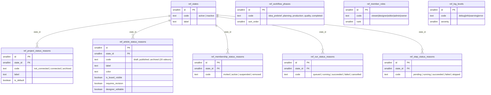
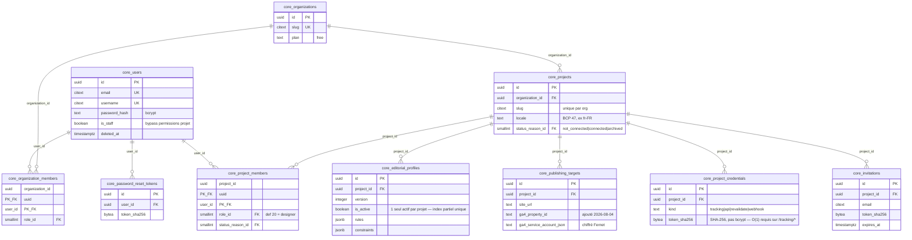

# Base de données — Ideas Studio

> Référence technique complète du schéma PostgreSQL v3 (production : Supabase).
> Source de vérité SQL : [`docs/schema-v3/refonte-schema-v3.sql`](schema-v3/refonte-schema-v3.sql)
> (DDL complet, 6 schémas, ~1000 lignes). Ce document en est la documentation
> lisible, avec les diagrammes ER et la carte de dépendance applicative que le
> SQL brut ne donne pas.
>
> Dernière vérification contre la base réelle : 2026-08-04 (voir §12, écarts connus).

---

## 1. Vue d'ensemble

- **Moteur** : PostgreSQL 15+, hébergé sur Supabase.
- **6 schémas applicatifs**, remplaçant un schéma plat unique (`public`) utilisé jusqu'au 2026-08-03 :

| Schéma | Rôle | Tables |
|---|---|---|
| `ref` | Vocabulaire de statuts et motifs — données de référence, quasi jamais écrites après le seed initial | 9 |
| `core` | Identité, tenancy, appartenance : utilisateurs, organisations, projets, membres | 10 |
| `content` | Contenu éditorial : articles, révisions, SEO, médias, mots-clés | 13 |
| `ai` | Orchestration IA : providers, agents, pipelines, exécutions, artefacts | 10 |
| `analytics` | Métriques : trafic, Search Console, recommandations | 3 |
| `ops` | Opérationnel : logs, notifications, webhooks | 4 |

- **Extensions** : `pgcrypto` (`gen_random_uuid()`), `citext` (emails/slugs insensibles à la casse), `pg_trgm` (recherche floue sur les titres). Les deux premières vivent dans le schéma `extensions` de Supabase, `pg_trgm` vit dans `public` (vérifié le 2026-08-04).
- **Clés primaires** : `uuid` partout (sauf tables de référence `ref.*`, `smallint`), générées par `gen_random_uuid()`.
- **Horodatage** : `timestamptz` partout — jamais de `timestamp` naïf (voir `app/core/database.py`, `type_annotation_map` force ce mapping côté ORM pour qu'Alembic ne propose jamais de le retirer).
- **Modèle multi-tenant** : `core.organizations` → `core.projects` → tout le reste. Un utilisateur accède à des projets via `core.project_members` (pas directement via l'organisation).
- **Concept central** : `content.articles` est **la seule table pour idées ET articles**. Une "idée" est un article dont `status_reason_id` vaut 10 (draft), 20 (idea_proposed), 30 (idea_priority) ou 200 (idea_rejected) — voir `ref.article_status_reasons`. Il n'existe pas de table `Idea` séparée dans le schéma v3 (contrairement à l'ancien schéma plat — voir §12).

---

## 2. Schéma complet — les 49 tables, clés et relations

Vue d'ensemble unique, toutes tables confondues. Volontairement réduite aux colonnes
**clé primaire / clé étrangère** (les colonnes métier complètes sont dans les diagrammes
par schéma, §3 à §7) — l'objectif ici est de voir la structure relationnelle entière d'un
coup d'œil, pas chaque colonne.

```mermaid
erDiagram
    %% ref
    ref_states ||--o{ ref_project_status_reasons : state_id
    ref_states ||--o{ ref_article_status_reasons : state_id
    ref_states ||--o{ ref_membership_status_reasons : state_id
    ref_states ||--o{ ref_run_status_reasons : state_id
    ref_states ||--o{ ref_step_status_reasons : state_id

    %% core
    ref_member_roles ||--o{ core_organization_members : role_id
    core_organizations ||--o{ core_organization_members : organization_id
    core_users ||--o{ core_organization_members : user_id
    core_organizations ||--o{ core_projects : organization_id
    ref_project_status_reasons ||--o{ core_projects : status_reason_id
    core_projects ||--o{ core_project_members : project_id
    core_users ||--o{ core_project_members : user_id
    ref_member_roles ||--o{ core_project_members : role_id
    ref_membership_status_reasons ||--o{ core_project_members : status_reason_id
    core_projects ||--o{ core_editorial_profiles : project_id
    core_users |o--o{ core_editorial_profiles : created_by
    core_projects ||--o{ core_publishing_targets : project_id
    core_projects ||--o{ core_project_credentials : project_id
    core_projects ||--o{ core_invitations : project_id
    ref_member_roles ||--o{ core_invitations : role_id
    core_users |o--o{ core_invitations : invited_by
    core_users |o--o{ core_invitations : accepted_by
    core_users ||--o{ core_password_reset_tokens : user_id

    %% content
    core_projects ||--o{ content_categories : project_id
    content_categories ||--o{ content_categories : parent_id
    core_projects ||--o{ content_articles : project_id
    content_categories |o--o{ content_articles : category_id
    content_articles |o--o{ content_articles : derived_from_id
    ref_article_status_reasons ||--o{ content_articles : status_reason_id
    content_articles ||--o{ content_article_revisions : article_id
    core_users |o--o{ content_article_revisions : created_by
    content_article_revisions |o--o{ content_articles : current_revision_id
    content_article_revisions |o--o{ content_articles : published_revision_id
    content_articles ||--|| content_article_seo : article_id
    core_projects ||--o{ content_keywords : project_id
    content_articles ||--o{ content_article_keywords : article_id
    content_keywords ||--o{ content_article_keywords : keyword_id
    content_articles ||--o{ content_article_links : article_id
    content_articles |o--o{ content_article_links : target_article_id
    core_projects ||--o{ content_media_assets : project_id
    content_articles ||--o{ content_article_media : article_id
    content_media_assets ||--o{ content_article_media : media_id
    content_articles ||--o{ content_article_scores : article_id
    content_article_revisions |o--o{ content_article_scores : revision_id
    content_articles ||--o{ content_article_comments : article_id
    core_users |o--o{ content_article_comments : author_id
    content_article_comments ||--o{ content_article_comments : parent_id
    core_projects ||--o{ content_board_columns : project_id
    ref_article_status_reasons |o--o{ content_board_columns : status_reason_id
    core_projects ||--o{ content_callout_templates : project_id

    %% ai
    ai_providers ||--o{ ai_provider_credentials : provider_id
    core_projects |o--o{ ai_provider_credentials : project_id
    ai_agents ||--o{ ai_agent_bindings : agent_id
    ai_providers ||--o{ ai_agent_bindings : provider_id
    core_projects |o--o{ ai_agent_bindings : project_id
    core_projects ||--|| ai_pipelines : project_id
    core_projects ||--o{ ai_pipeline_runs : project_id
    ref_run_status_reasons ||--o{ ai_pipeline_runs : status_reason_id
    content_articles ||--o{ ai_workflow_runs : article_id
    ai_pipeline_runs |o--o{ ai_workflow_runs : pipeline_run_id
    ref_workflow_phases |o--o{ ai_workflow_runs : phase_id
    ref_run_status_reasons ||--o{ ai_workflow_runs : status_reason_id
    ai_workflow_runs ||--o{ ai_workflow_steps : run_id
    ai_agents ||--o{ ai_workflow_steps : agent_id
    ref_step_status_reasons ||--o{ ai_workflow_steps : status_reason_id
    content_articles ||--o{ ai_artifacts : article_id
    ai_workflow_steps |o--o{ ai_artifacts : step_id
    ref_step_status_reasons ||--o{ ai_usage_events : status_reason_id

    %% analytics
    core_projects ||--o{ analytics_optimization_recommendations : project_id
    content_articles |o--o{ analytics_optimization_recommendations : article_id
    ref_run_status_reasons ||--o{ analytics_optimization_recommendations : status_reason_id
    content_articles ||--o{ analytics_search_metrics_daily : article_id

    %% ops
    core_projects ||--o{ ops_notifications : project_id
    core_users |o--o{ ops_notifications : user_id
    ref_log_levels ||--o{ ops_notifications : level_id
    ref_log_levels ||--o{ ops_event_logs : level_id
    core_projects ||--o{ ops_webhooks : project_id
    ops_webhooks ||--o{ ops_webhook_deliveries : webhook_id

    ref_states { smallint id PK }
    ref_project_status_reasons { smallint id PK }
    ref_article_status_reasons { smallint id PK }
    ref_membership_status_reasons { smallint id PK }
    ref_run_status_reasons { smallint id PK }
    ref_step_status_reasons { smallint id PK }
    ref_workflow_phases { smallint id PK }
    ref_member_roles { smallint id PK }
    ref_log_levels { smallint id PK }

    core_users { uuid id PK }
    core_organizations { uuid id PK }
    core_organization_members { uuid organization_id PK }
    core_projects { uuid id PK }
    core_project_members { uuid project_id PK }
    core_editorial_profiles { uuid id PK }
    core_publishing_targets { uuid id PK }
    core_project_credentials { uuid id PK }
    core_invitations { uuid id PK }
    core_password_reset_tokens { uuid id PK }

    content_categories { uuid id PK }
    content_articles { uuid id PK }
    content_article_revisions { uuid id PK }
    content_article_seo { uuid article_id PK }
    content_keywords { uuid id PK }
    content_article_keywords { uuid article_id PK }
    content_article_links { uuid id PK }
    content_media_assets { uuid id PK }
    content_article_media { uuid article_id PK }
    content_article_scores { uuid id PK }
    content_article_comments { uuid id PK }
    content_board_columns { uuid id PK }
    content_callout_templates { uuid id PK }

    ai_providers { uuid id PK }
    ai_provider_credentials { uuid id PK }
    ai_agents { uuid id PK }
    ai_agent_bindings { uuid id PK }
    ai_pipelines { uuid project_id PK }
    ai_pipeline_runs { uuid id PK }
    ai_workflow_runs { uuid id PK }
    ai_workflow_steps { uuid id PK }
    ai_artifacts { uuid id PK }
    ai_usage_events { uuid id PK }

    analytics_traffic_events { uuid id PK }
    analytics_search_metrics_daily { uuid article_id PK }
    analytics_optimization_recommendations { uuid id PK }

    ops_event_logs { uuid id PK }
    ops_notifications { uuid id PK }
    ops_webhooks { uuid id PK }
    ops_webhook_deliveries { uuid id PK }
```



**Tables volontairement isolées sur ce diagramme** : `analytics.traffic_events` et
`ops.event_logs` n'ont **aucune** relation dessinée vers `core.projects` — pas un oubli,
elles n'ont réellement aucune contrainte `FOREIGN KEY` déclarée sur leurs colonnes
`project_id`/`article_id`/`actor_id` (voir §7). C'est la seule vraie rupture du modèle
relationnel dans tout le schéma, et le diagramme le montre tel quel plutôt que de le
masquer par une relation qui n'existe pas en base.

---

## 3. Modèle de statuts (`ref`) — le vocabulaire partagé

Chaque entité avec un cycle de vie (`projects`, `articles`, `organization_members`/`project_members`, `pipeline_runs`/`workflow_runs`, `workflow_steps`) référence une paire `(state_id, status_reason_id)` :

- **`state_id`** (`ref.states`) : niveau macro, seulement 2 valeurs — `0 = active`, `1 = inactive`. Universel, partagé par toutes les entités.
- **`status_reason_id`** : le motif réel, spécifique à chaque entité, dans sa propre table `ref.*_status_reasons`. Contrainte FK composite `(status_reason_id, state_id)` — impossible d'associer un motif au mauvais état macro.



### `ref.article_status_reasons` — les 20 motifs, la table la plus consultée du schéma

| id | code | state | board | requires_revision | designer_editable |
|---|---|---|---|---|---|
| 10 | `draft` | active | ✓ | | ✓ |
| 20 | `idea_proposed` | active | ✓ | | |
| 30 | `idea_priority` | active | ✓ | | |
| 40 | `outline_ready` | active | ✓ | | |
| 50 | `writing_requested` | active | ✓ | | |
| 60 | `writing_in_progress` | active | ✓ | | |
| 70 | `draft_ready` | active | ✓ | | ✓ |
| 80 | `review_needed` | active | ✓ | | ✓ |
| 90 | `correction_needed` | active | ✓ | | ✓ |
| 100 | `ready_to_publish` | active | ✓ | | ✓ |
| 110 | `scheduled` | active | ✓ | | |
| 120 | `published` | active | ✓ | ✓ | |
| 130 | `unpublished` | active | ✓ | ✓ | |
| 140 | `update_recommended` | active | | | |
| 150 | `improvement_proposed` | active | | | |
| 160 | `improvement_in_progress` | active | | | |
| 170 | `improvement_ready` | active | | | |
| 180 | `failed` | active | ✓ | | |
| 190 | `blocked_cost_limit` | active | ✓ | | |
| 200 | `idea_rejected` | inactive | | | |
| 210 | `archived` | inactive | | | |

**Piège documenté dans le SQL lui-même** : `scheduled` (110) n'exige **pas** de révision publiée — programmer un article ne fige pas encore son contenu (`published_revision_id` reste `NULL` jusqu'à la publication réelle). Un trigger (`content.enforce_publication_rules`) fait respecter ça en base, pas seulement côté code.

---

## 4. `core` — identité et tenancy



**Points notables**

- `core.projects.status_reason_id` n'a **que 2 valeurs observables en réalité** (`not_connected`, `connected` — bascule automatique au premier événement `/tracking/*` reçu). `archived` existe en anticipation d'un archivage explicite pas encore implémenté côté application.
- `core.project_credentials.token_sha256` : hash SHA-256 volontairement (pas bcrypt) — ces tokens sont déjà aléatoires sur 32+ octets, un hash lent pénaliserait inutilement chaque requête `/tracking/*` qui doit rester O(1).
- `core.editorial_profiles` est **versionné** (`version` + `is_active`), pas mis à jour en place — un index unique partiel garantit un seul profil actif par projet.
- `core.publishing_targets.ga4_*` : ajout du 2026-08-04 (commit du collègue), vérifié présent en base réelle.

---

## 5. `content` — le contenu éditorial

C'est le schéma le plus dense (13 tables) et celui qui concentre l'essentiel de la logique produit.

```mermaid
erDiagram
    core_projects ||--o{ content_categories : "project_id"
    content_categories ||--o{ content_categories : "parent_id (self)"
    core_projects ||--o{ content_articles : "project_id"
    content_categories |o--o{ content_articles : "category_id"
    content_articles ||--o{ content_articles : "derived_from_id (self)"
    content_articles ||--o{ content_article_revisions : "article_id"
    content_articles ||--|| content_article_seo : "article_id (1:1)"
    core_projects ||--o{ content_keywords : "project_id"
    content_articles }o--o{ content_keywords : "content_article_keywords"
    content_articles ||--o{ content_article_links : "article_id"
    core_projects ||--o{ content_media_assets : "project_id"
    content_articles }o--o{ content_media_assets : "content_article_media"
    content_articles ||--o{ content_article_scores : "article_id"
    content_articles ||--o{ content_article_comments : "article_id"
    content_article_comments ||--o{ content_article_comments : "parent_id (self)"
    core_projects ||--o{ content_board_columns : "project_id"
    core_projects ||--o{ content_callout_templates : "project_id"

    content_articles {
        uuid id PK
        uuid project_id FK
        uuid category_id FK "nullable"
        uuid derived_from_id FK "nullable, self"
        citext slug "unique par projet"
        smallint status_reason_id FK "20 valeurs — idée OU article"
        text sub_niche
        integer target_word_count
        numeric opportunity_score
        uuid current_revision_id FK "nullable, ajoutée après coup (FK circulaire)"
        uuid published_revision_id FK "nullable — trigger l'exige si status = published/unpublished"
        timestamptz scheduled_for
        timestamptz published_at
    }
    content_article_revisions {
        uuid id PK
        uuid article_id FK
        integer revision_no "unique par article"
        content_revision_source source "ai|human|import|rollback"
        text title
        text body
        jsonb blocks
        jsonb faq
        jsonb callouts
    }
    content_article_seo {
        uuid article_id PK_FK "1:1 — PK = FK"
        text meta_title
        text meta_description
        jsonb structured_data
    }
    content_keywords {
        uuid id PK
        uuid project_id FK
        citext term "unique par projet"
    }
    content_article_keywords {
        uuid article_id PK_FK
        uuid keyword_id PK_FK
        content_keyword_role role "primary(1 max)|secondary|entity"
    }
    content_article_links {
        uuid id PK
        uuid article_id FK
        content_link_kind kind "internal|external"
        uuid target_article_id FK "nullable, requis si internal"
        text target_url "requis si external"
    }
    content_media_assets {
        uuid id PK
        uuid project_id FK
        text url
        text filename
    }
    content_article_media {
        uuid article_id PK_FK
        uuid media_id PK_FK
        content_media_role role "cover|inline|thumbnail|og"
    }
    content_article_scores {
        uuid id PK
        uuid article_id FK
        uuid revision_id FK "nullable"
        numeric seo_score
        numeric quality_score
        numeric eeat_score
        numeric global_score
        timestamptz evaluated_at "historisé — pas d'update en place"
    }
    content_article_comments {
        uuid id PK
        uuid article_id FK
        uuid parent_id FK "self, threads"
        text body
        timestamptz resolved_at
    }
    content_board_columns {
        uuid id PK
        uuid project_id FK
        smallint status_reason_id FK "nullable"
        citext custom_key "nullable — XOR avec status_reason_id"
    }
    content_categories {
        uuid id PK
        uuid project_id FK
        uuid parent_id FK "self, nullable"
        citext slug "unique par projet"
        jsonb overrides
    }
    content_callout_templates {
        uuid id PK
        uuid project_id FK
        citext slug "unique par projet"
        jsonb style
    }
```

**Points notables**

- `content.articles.current_revision_id` / `published_revision_id` : FK ajoutées **après** la création de `article_revisions` (`ALTER TABLE` séparé, ligne 471 du DDL) — dépendance circulaire classique entre les deux tables, résolue dans l'ordre de création.
- **Trigger `content.enforce_publication_rules`** (BEFORE INSERT/UPDATE sur `status_reason_id`/`published_revision_id`) : refuse en base qu'un article passe `published`/`unpublished` sans `published_revision_id` posé. Règle métier appliquée au niveau SQL, pas seulement Python.
- `content.board_columns` : `CHECK` XOR entre `status_reason_id` et `custom_key` — une colonne kanban est **soit** liée à un motif de statut réel, **soit** une voie totalement libre (`app/routers/kanban_columns.py`), jamais les deux.
- `content.article_scores` est un historique **append-only** (jamais d'`UPDATE`) — chaque évaluation crée une nouvelle ligne, la vue `content.v_article_latest_score` (`DISTINCT ON`) donne le dernier score.
- Recherche floue sur les titres : index `revisions_title_trgm_idx` (`gin_trgm_ops`, extension `pg_trgm`).

---

## 6. `ai` — orchestration et pipeline IA

```mermaid
erDiagram
    ai_providers ||--o{ ai_provider_credentials : "provider_id"
    core_projects ||--o{ ai_provider_credentials : "project_id (nullable=global)"
    ai_agents ||--o{ ai_agent_bindings : "agent_id"
    ai_providers ||--o{ ai_agent_bindings : "provider_id"
    core_projects ||--o{ ai_agent_bindings : "project_id (nullable=global)"
    core_projects ||--|| ai_pipelines : "project_id (1:1, PK=FK)"
    core_projects ||--o{ ai_pipeline_runs : "project_id"
    content_articles ||--o{ ai_workflow_runs : "article_id"
    ai_pipeline_runs ||--o{ ai_workflow_runs : "pipeline_run_id"
    ai_workflow_runs ||--o{ ai_workflow_steps : "run_id"
    ai_agents ||--o{ ai_workflow_steps : "agent_id"
    content_articles ||--o{ ai_artifacts : "article_id"
    ai_workflow_steps |o--o{ ai_artifacts : "step_id"

    ai_providers {
        uuid id PK
        text code UK "ollama|openrouter|openai|gemini|mistral|mock"
        boolean is_enabled
    }
    ai_provider_credentials {
        uuid id PK
        uuid provider_id FK
        uuid project_id FK "nullable"
        text secret_ref "référence coffre, pas le secret en clair"
    }
    ai_agents {
        uuid id PK
        text key UK
        ai_agent_category category "research|strategy|creation|review"
        ai_agent_status status "active|heuristic|partial|planned|disabled|not_implemented"
        text output_json_field "trace historique — ex-colonne article.*_json"
    }
    ai_agent_bindings {
        uuid id PK
        uuid agent_id FK
        uuid provider_id FK
        uuid project_id FK "nullable=binding global"
        text model
        smallint priority
    }
    ai_pipelines {
        uuid project_id PK_FK "1:1"
        boolean is_enabled
        smallint articles_per_week
        jsonb schedule
        numeric cost_limit_per_article
    }
    ai_pipeline_runs {
        uuid id PK
        uuid project_id FK
        smallint status_reason_id FK "queued|running|succeeded|failed|cancelled"
        integer ideas_generated
        integer articles_created
    }
    ai_workflow_runs {
        uuid id PK
        uuid article_id FK
        uuid pipeline_run_id FK "nullable"
        smallint phase_id FK "idea_prebrief..completed"
        smallint status_reason_id FK "issue d'exécution"
        boolean cancel_requested
    }
    ai_workflow_steps {
        uuid id PK
        uuid run_id FK
        uuid agent_id FK
        smallint attempt "unique(run_id, agent_id, attempt)"
        smallint status_reason_id FK
    }
    ai_artifacts {
        uuid id PK
        uuid article_id FK
        uuid step_id FK "nullable"
        text agent_key
        jsonb payload "index GIN jsonb_path_ops"
    }
    ai_usage_events {
        uuid id PK
        timestamptz occurred_at PK "partitionné par mois"
        uuid project_id
        text agent_key
        integer prompt_tokens
        numeric estimated_cost
        numeric actual_cost
    }
```

**Points notables**

- **Deux axes de statut distincts pour un article en cours de rédaction**, qui coexistent volontairement (reflet exact du code Python `Article.status` vs `Article.workflow_status`) :
  - `content.articles.status_reason_id` → étape éditoriale (kanban).
  - `ai.workflow_runs.phase_id` → phase macro du pipeline IA (`idea_prebrief → planning → production → quality → completed`).
  - `ai.workflow_runs.status_reason_id` → issue technique de l'exécution (`queued/running/succeeded/failed/cancelled`), indépendante de la phase.
- `ai.agents` est un **cache interrogeable, pas une source de vérité** : rempli/synchronisé au démarrage de l'app depuis `app/services/agents/agent_registry.py` (62 agents définis en Python). Modifier cette table directement en SQL serait écrasé au prochain redémarrage.
- `ai.agent_bindings` et `ai.provider_credentials` : `project_id NULL` = configuration **globale par défaut**, sinon spécifique à un projet — deux index uniques partiels (`WHERE project_id IS NULL` / `WHERE project_id IS NOT NULL`) empêchent les doublons dans chaque cas sans les confondre.
- `ai.usage_events` : partitionné par mois (`PARTITION BY RANGE (occurred_at)`), partition initiale `ai.usage_events_2026_08` seulement — **nécessite une création de partition mensuelle récurrente**, aucune automatisation trouvée dans le code à ce jour (voir §12, écart à surveiller).

---

## 7. `analytics` et `ops`

```mermaid
erDiagram
    core_projects ||--o{ analytics_traffic_events : "project_id"
    content_articles |o--o{ analytics_traffic_events : "article_id (nullable)"
    content_articles ||--o{ analytics_search_metrics_daily : "article_id"
    core_projects ||--o{ analytics_optimization_recommendations : "project_id"
    content_articles |o--o{ analytics_optimization_recommendations : "article_id (nullable)"

    core_projects |o--o{ ops_event_logs : "project_id (nullable)"
    core_projects ||--o{ ops_notifications : "project_id"
    core_users |o--o{ ops_notifications : "user_id (nullable)"
    core_projects ||--o{ ops_webhooks : "project_id"
    ops_webhooks ||--o{ ops_webhook_deliveries : "webhook_id"

    analytics_traffic_events {
        uuid id PK
        timestamptz occurred_at PK "partitionné par mois"
        uuid project_id "PAS de FK déclarée (colonne libre)"
        text path
        text visitor_hash
    }
    analytics_search_metrics_daily {
        uuid article_id PK_FK
        date metric_date PK
        integer impressions
        integer clicks
        numeric avg_position
    }
    analytics_optimization_recommendations {
        uuid id PK
        uuid project_id FK
        uuid article_id FK "nullable"
        text type
        smallint status_reason_id FK
    }
    ops_event_logs {
        uuid id PK
        timestamptz occurred_at PK "partitionné par mois"
        uuid project_id "PAS de FK déclarée"
        uuid actor_id "PAS de FK déclarée"
        smallint level_id FK
        text scope
        text action
    }
    ops_notifications {
        uuid id PK
        uuid project_id FK
        uuid user_id FK "nullable"
        smallint level_id FK
        timestamptz read_at
    }
    ops_webhooks {
        uuid id PK
        uuid project_id FK
        text url
        text[] events
        text secret_ref
    }
    ops_webhook_deliveries {
        uuid id PK
        uuid webhook_id FK
        integer status_code
        smallint attempt
    }
```

**Points notables — écarts volontaires au modèle relationnel strict**

- `analytics.traffic_events.project_id`, `ops.event_logs.project_id`/`actor_id` : **colonnes `uuid` sans contrainte `REFERENCES`**, contrairement à tout le reste du schéma. Vu leur volume (tables partitionnées, écriture haute fréquence, `traffic_events` alimentée par un endpoint public non authentifié), une FK vérifiée à chaque insertion serait coûteuse et fragile. L'intégrité est assurée côté application, pas côté base, pour ces deux tables précisément.
- `analytics.traffic_events` est la table qui **n'est pas couverte par `rls-a-activer-plus-tard.sql`** (voir §8) alors qu'elle est clairement scoping par projet — à trancher explicitement avant d'activer RLS (voir §8).

---

## 8. Sécurité — Row Level Security (RLS)

**État réel au 2026-08-04 : RLS n'est PAS activé en production**, malgré le bloc RLS présent en fin de [`docs/schema-v3/refonte-schema-v3.sql`](schema-v3/refonte-schema-v3.sql) (lignes 961-1011). Vérifié empiriquement (`rowsecurity = true` sur 0 table). Le script d'activation réel et à jour est [`db/migration-v3/rls-a-activer-plus-tard.sql`](../db/migration-v3/rls-a-activer-plus-tard.sql), piloté par [`docs/schema-v3/plan-activation-rls.md`](schema-v3/plan-activation-rls.md) (audit complet des 31 routers, prérequis d'infra, procédure). Ne pas se fier au bloc RLS du DDL comme preuve que c'est actif.

**Tables prévues sous RLS** (politique `tenant_isolation`, `project_id = core.current_project_id()`) :

| Isolation directe (colonne `project_id`) | Isolation via l'article parent |
|---|---|
| `content.articles`, `content.categories`, `content.media_assets`, `content.keywords`, `content.callout_templates`, `content.board_columns` | `content.article_revisions`, `content.article_seo`, `content.article_scores`, `content.article_comments`, `content.article_links`, `content.article_keywords`, `content.article_media` |
| `core.editorial_profiles`, `core.publishing_targets`, `core.project_credentials` | `ai.workflow_runs`, `ai.artifacts`, `analytics.search_metrics_daily` |
| `ai.pipeline_runs`, `ops.notifications`, `analytics.optimization_recommendations` | |

Absent de cette liste, à trancher explicitement : `analytics.traffic_events` (aucune FK `project_id` — voir §6), `core.projects`/`core.project_members` (nécessairement hors RLS, ce sont elles qui permettent de résoudre l'appartenance avant de poser le contexte). Détail des colonnes sans FK : §7.

---

## 9. Carte de dépendance applicative — qui touche quoi

Cartographie construite lors de l'audit RLS (2026-08-04) : quelle partie du backend dépend de quel schéma/table.

| Domaine (schéma) | Routers principaux | Services principaux | Pages frontend concernées |
|---|---|---|---|
| `core` (identité/tenancy) | `auth.py`, `projects.py`, `members.py`, `invitations.py`, `profile.py` | `app/dependencies/auth.py` (résolution de session/membre — **point d'entrée central**) | `/login`, `/projects`, `/projects/:id/settings` |
| `content` (articles/idées) | `articles.py`, `ideas.py`, `editor.py`, `categories.py`, `comments.py`, `versions.py`, `kanban_columns.py`, `callouts.py`, `media.py`, `seo.py`, **`public_api.py`** (public, sans auth) | `article_service.py`, `article_lifecycle_service.py`, `category_service.py`, `production_queue.py` | `/articles`, `/ideas`, `/kanban`, `/calendar`, éditeur, sites publics `p/:slug` |
| `ai` (pipeline IA) | `ai_agents.py`, `ai_providers.py`, `generation.py`, `pipeline.py` | `pipeline_service.py`, `agent_registry.py`, `agent_router.py`, `seo_generation_orchestrator.py`, `providers/llm_provider.py` | `/generate`, `/projects/:id/settings` (onglets providers/agents/pipeline) |
| `analytics` | `analytics.py`, `performance.py`, `search_console.py`, **`tracking.py`** (public, sans auth) | `ga4_service.py`, `tracking_service.py` | `/traffic`, `/performance` |
| `ops` | `notifications.py`, `webhooks.py`, `activity.py` | `log_service.py` | `/notifications`, `/projects/:id/settings` (webhooks) |
| `ref` | Aucun router direct — lu partout via les modèles `app/models/reference.py` (IntEnum synchronisés, voir `tests/test_reference_sync.py`) | — | Traduit en français côté `frontend/src/lib/status.ts`, jamais stocké en base |

**Chemins d'accès aux tables `content.*`/`ai.*` protégées par RLS (une fois activé) — 3 mécanismes différents** :
1. Dépendance FastAPI `get_project_member` (la majorité des routes) — pose le contexte projet automatiquement.
2. Jobs planifiés (`app/services/worker.py`, `app/cli.py`) — boucle explicite par projet, contexte posé manuellement (câblé le 2026-08-04, voir historique git).
3. Thread parallèle de rédaction (`app/services/production_queue.py:write_queued_article`) — session et contexte propres, thread dédié.

Le détail fichier-par-fichier (31 routers passés en revue un par un) est dans [`docs/schema-v3/plan-activation-rls.md`](schema-v3/plan-activation-rls.md) §4 — ce tableau en est le résumé.

---

## 10. Vues

| Vue | Rôle |
|---|---|
| `content.v_articles_current` | Article "à plat" — jointure article + révision courante + SEO + libellés de statut. Route de lecture directe sans attendre la réécriture complète d'un service. |
| `content.v_articles_published` | Idem, filtré `status_reason_id = 120`, jointe sur `published_revision_id` (pas `current_revision_id`) — ce que le site public doit lire. |
| `content.v_article_latest_score` | `DISTINCT ON (article_id)` sur `article_scores`, dernier score évalué. |
| `content.v_board_columns` | Union des colonnes kanban liées à un motif de statut réel ET des voies libres (`custom_key`) — vue pensée spécifiquement pour représenter les deux formes que `content.board_columns` autorise. |
| `core.v_projects` | Projet + libellés de statut résolus. |

---

## 11. Partitionnement

Trois tables à haut volume, partitionnées par mois (`PARTITION BY RANGE (occurred_at)`) :

- `ai.usage_events` — coût/tokens par appel IA.
- `analytics.traffic_events` — événements de trafic public.
- `ops.event_logs` — journal d'activité.

**Une seule partition existe aujourd'hui pour chacune** (`*_2026_08`, couvrant août 2026). Aucune automatisation de création de partition future n'a été trouvée dans le code (`app/services/`, `app/cli.py`) — **à créer avant le 1er septembre 2026**, sous peine d'échec d'insertion sur ces 3 tables. À vérifier / planifier (cron mensuel, ou `pg_partman` si le volume le justifie).

---

## 12. Écarts connus entre la documentation, le code et la base réelle

Points de vigilance à tenir à jour — ne pas laisser ce document dériver comme les précédents (`db/migration-v3/02-donnees.sql` vs le script réellement exécuté, voir `db/migration-v3/archive/REPRENDRE-LA-MAIN.md`) :

1. **RLS non actif malgré sa présence dans le DDL** — voir §8. Le bloc RLS de `refonte-schema-v3.sql` documente une *intention*, pas l'état réel.
2. **`CLAUDE.md` liste encore un modèle `Idea` séparé** (table dédiée "Idées SEO / opportunités") — obsolète depuis la refonte v3 : les idées sont des `content.articles` avec un motif spécifique (§1). À corriger dans `CLAUDE.md`.
3. **`analytics.traffic_events`/`ops.event_logs` sans FK `project_id`/`actor_id`** — voulu pour la performance d'écriture, mais signifie qu'aucune contrainte base n'empêche une valeur orpheline. À surveiller si des incohérences apparaissent en usage réel.
4. **Partitions mensuelles non automatisées** — voir §11, échéance concrète début septembre 2026.
5. **Schéma `legacy`** (ancien schéma plat pré-refonte, 25 tables) conservé comme filet de sécurité depuis la bascule du 2026-08-03 — prévu pour suppression après 1-2 semaines (`DROP SCHEMA legacy CASCADE`, non fait à la date de ce document, ne pas faire avant le 17/08/2026 environ).
6. **`db/migration-v3/01-schema.sql` et `docs/schema-v3/refonte-schema-v3.sql` sont deux versions distinctes** de la même intention (v3.1 vs v3.1 révisée) — ce document s'appuie sur `refonte-schema-v3.sql` car c'est la version la plus proche du code actuel (`app/models/*.py`). Envisager d'archiver l'une des deux pour éviter la confusion qui a déjà eu lieu une fois sur `02-donnees.sql`.

---

## 13. Où trouver le reste

| Besoin | Fichier |
|---|---|
| DDL complet, exécutable | `docs/schema-v3/refonte-schema-v3.sql` |
| Historique des décisions de conception du schéma v3 | `docs/schema-v3/CHANGELOG.md`, `docs/schema-v3/plan-migration-v3.md` |
| Script de bascule des données (v2 → v3) réellement exécuté | `docs/schema-v3/migration-bigbang-v3.sql` |
| Activer RLS : audit, prérequis, procédure | `docs/schema-v3/plan-activation-rls.md` |
| Modèles SQLAlchemy (mapping ORM) | `app/models/{core,content,ai,analytics,ops,reference}.py` |
| Résolution de session/tenancy côté code | `app/core/database.py`, `app/dependencies/auth.py` |
